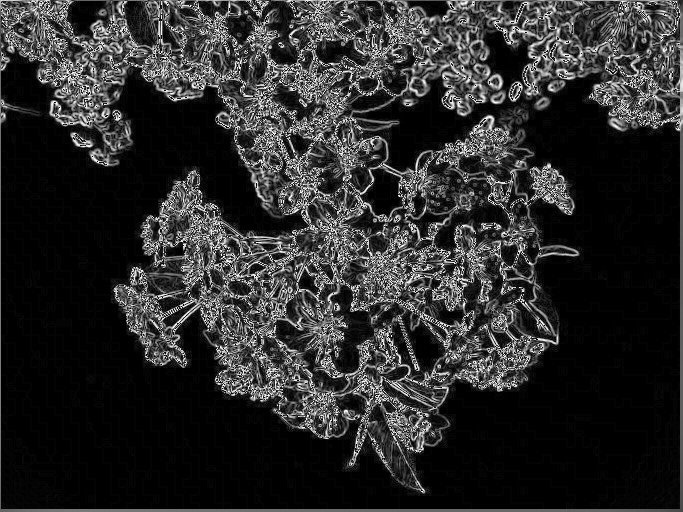

# Deimos

Deimos is an experimental computer vision library in C

> I am trying to distill my knowledge into [a computer vision guide](https://aadv1k.gitbook.io/cv-guide), which serves as an introductory guide to this field and goes into details about the algorithms implemented below. I welcome any suggestions/critiques, thanks!

## Features

- Transformations
  - Affine
    - [ ] Rotation
    - [ ] Scaling
    - [ ] Shearing
    - [ ] Translation
  - Perspective
    - [ ] Warping
    - [ ] Skewing
- Smoothing
  - [X] Gaussian filter
  - [X] Median filter
  - [X] Bilateral filter
  - [X] Box filter
- Edge detection
  - [X] Unsharp mask
  - [X] Laplacian Filter (Difference of Gaussian)
  - [X] Sobel operator
- Color
  - [X] Greyscale
- Thresholding
  - [X] Global
  - [X] Otsu's Method
- Feature extraction
  - [X]  Harris corner detection

## Build (Make)

```
git clone git@github.com:aadv1k/deimos
cd deimos/
make
```

## Build (without make)

> If you don't have make on windows, you can instead use the `build.bat`, it gets the job done.

```console
git clone git@github.com:aadv1k/deimos
cd deimos/
.\build.bat
```

## Examples

> **Note**
> The filters are un-optimized, they work best on smaller images

```console
.\cv gray ..\data\img1.jpg .\output.png
.\cv sharpen --sigma 3 ..\data\img1.jpg .\output.png
.\cv blur --kernel 9 --sigma 5 ..\data\img1.jpg .\output.png
```

## Usage

```console
$ ./deimos.exe
Usage:
  C:\Users\Aadv1k\Desktop\deimos\bin\deimos.exe <command> <args> input output

Commands:
  Smoothing:
    blur, gaussian    Apply Gaussian blur to the image.
    median            Apply median filter to the image.
    bilateral         Apply bilateral filter to the image.
    box, mean         Apply box filter onto the image.

  Edge Detection:
    sobel             Apply Sobel filter to the image.
    laplacian         Apply Laplacian filter onto the image.
    sharpen           Sharpen image via an unsharp mask.

  Thresholding:
    global-threshold  Apply the global threshold filter over the image. 'sigma' would be the threshold.
    otsu-threshold    Apply Otsu's threshold filter over the image.

  Feature Extraction:
    harris-corners    Detect corners within the image via Harris corner detection.

Other Commands:
    gray              Convert image to grayscale.
    help              Print this help message.

Options:
  --sigma             Specify the primary modifier for the convolutions.
  --kernel            Define the kernel size for convolutions (if applicable).
  --sobel-disable     Disable specifying a magnitude for the operator, default to setting gradient magnitude
```

## Gallery

> **Note**
> this showcases only some of the many avaliable filters

### Gaussian blur

```console
.\bin\deimos blur --kernel 9 --sigma 3 .\data\img1.jpg .\img1-gaussian-3-9.png
```

| Original Image | Gaussian Blur |
| --- | --- |
|  |  |

### Median filter

```console
.\bin\deimos median --kernel 9 .\data\img1.jpg ..\output.jpg
```

| Original Image | Median Filter |
| --- | --- |
|  |  |

### Unsharp mask

```bash
.\bin\deimos sharpen --kernel 9 --sigma 1.2 .\data\img1.jpg ..\output.jpg
```


| Original Image | Unsharp Mask |
| --- | --- |
|  |  |

### Laplacian filter

```shell
.\bin\deimos laplacian --kernel 3 --sigma 1.5 .\data\img1.jpg .\output.jpg
```

| Original Image | Laplacian Filter |
| --- | --- |
|  |  |

</div>


### Sobel operator

```shell
.\bin\deimos sobel --sobel-disable .\data\img1.jpg .\output.jpg
```

| Original Image | Laplacian Filter |
| --- | --- |
|  |  |

</div>
