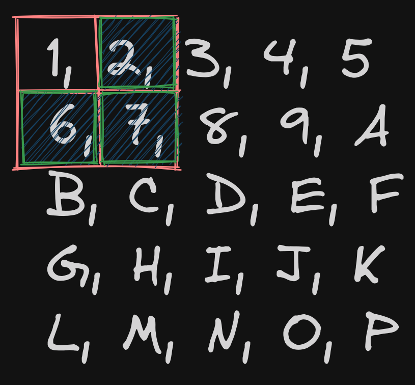

# Convolutions and Filters

To better understand all the sections which follow, Let's understand some of the jargon present within this space; A **Convolution** is a function which takes in an image and an **Area** let's call this `N`

`N` refers to what is known as a **Kernel size** in context of CV we perform modifications to the pixels across an area or the Kernel, think of it as a stencil -- you place it on a 2D list of pixels and do some calculation on whatever pixels are contained within this stencil, this would mean that a kernel of dimensions 3x3 would encapsulate the current pixel, and eight other neighboring pixels. Rinse and repeat for every pixel within the image and you've got yourself a Convolution. Here is a visualization of what a kernel is.

<figure><figcaption>
Kernel 2x2
</figcaption></figure>

 

<figure><figcaption>
Kernel 3x3
</figcaption></figure>

> **Note** I will use pixels and array of integers interchangeably, when I say pixel it always implies it encapsulates three integers for RGB (for most cases)

The terms **filter** and **mask** can also be used interchangeably with convolution functions. You may see me do this in the modules that follow.
