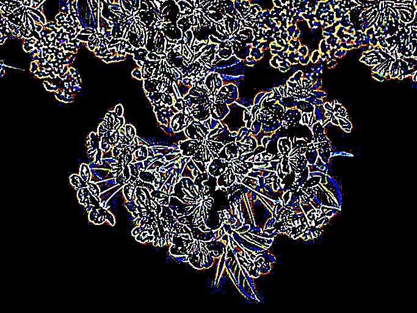

# Laplacian Filter

The Laplacian is a "Second-Order Derivative filter" this means that is operates upon a convolution and not a image. There are several methods to implement Laplacian filter but given the context of this module we are going to be using the DoG or Difference of Gaussian method, and it is what it sounds like, it words by subtracting a image of lower Gaussian sigma by a higher one, effectively giving us the difference. As we recall previously, we did something similar in the sharpening algorithm, except the [minuend](https://www.mathsisfun.com/definitions/minuend.html) was the base image, in this case its a blurred image of a smaller sigma. 

> **Note**
> If you are having trouble understanding this, I suggest you to refresh upon the [Gaussian Filter](../image-smoothing/gaussian-filter.md)


## Implementation

The Laplacian filter is implemented at [src/edge-detection/laplacian.c](../../src/edge-detection/laplacian.c)

```c
void cv_apply_laplacian_filter(Image* img, float sigma, int kernSize) {
  /* ... */

  float sigma1 = sigma;
  int kernSize1 = kernSize * 1.5 + 1;

  cv_apply_gaussian_blur(img, sigma1, kernSize1);
  
  /* ... */

  cv_apply_gaussian_blur(&copiedImage, sigma, kernSize);

  for (int i = 0; i < height; i++) {
    for (int j = 0; j < width; j++) {
      for (int c = 0; c < channels; c++) {
        int index = (i * width + j) * channels + c;
        img->bytes[index] = img->bytes[index] - copiedImage.bytes[index];
      }
    }
  }

  /* ... */
}
```

- We compute a differnt `sigma1`, and `kernSize1` since we don't want the user to specify both of these. `kernSize * 1.5 + 1` is really arbitiary and I suggest you mess around with differnt variations.

- We loop through and subtract the less blurred image from the one which is more blurred.

And that is really it! let's look at what this produces.

## Result

```shell
.\bin\cv --laplacian --kernel 3 --sigma 1.5 .\data\img1.jpg .\output.jpg
```

<div>
<figure><figcaption><p>Original image</p></figcaption></figure>
<figure><figcaption><p>Laplacian filter of Sigma 1.5, Kernel 3</p></figcaption></figure>
</div>

## Problems

> It is somewhat computationally slow

Like the previous filters an image of higher size and/or a higher kernel will directly affect the speed of the function (benchmarked on a larger image)

```
Laplacian Filter
----------------
kernelSize = 3: 10.4806246 sec
```

> False noise can cause bad edge detection

As the title suggests, even a slight noise will translate into the result, which is generally not good for a edge detector
