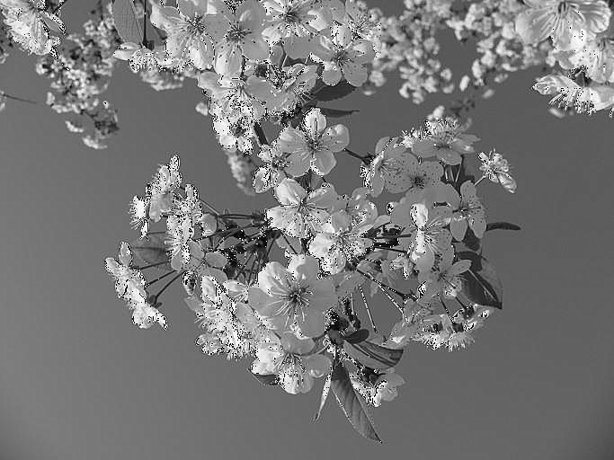

# Sharpening

You must be familiar with a concept in graphics known as *Sharpening* It works by highlighting certain features of the image to make them appear more defined, however if one increases this factor too much it can lead to a harsher contrast and image artefacts. Sharpening has several use cases when done right, for instance it can help make out information from an otherwise noisy or "torn" images, this makes it vital to Computer Vision where identifying parameters from an image is directly related to the performance and accuracy of a model, eg Self-Driving AI recognizing other cars from a poor lighting.

**Unsharp mask** is one such technique to highlight features within an image. It is what is called a **High-Pass** filter which basically means it highlights the details within the image (compared to **Low-Pass** filters such as the [Gaussian Blur](../image-smoothing/gaussian-filter.md) which reduce the details), It works by generating a copy of the image , then applying Gaussian Blur on the said image.

For a moment let's think about a blurred image, it reduces the noise within the image to the point where the details are indiscernible, however macro-factors such as edges are still visible. Unsharp filter works by adding the difference of a blurred and an original image to the original image, effectively highlighting the macro-features within the original image even more. Let's see this in action.

## Implementation

The Unsharp filter is implemented at [src/edge-detection/sharpen.c](../../src/edge-detection/sharpen.c) Let's take a deeper look at it. Here is a demonstration of it in C

```c
void cv_apply_sharpening(Image *img, float strength, int kernSize) {
  cv_apply_grayscale(img);

  /* ... */

  for (size_t i = 0; i < imgSize; i++) {
	int sharpenedValue = originalImage[i] + strength * (originalImage[i] - blurredImage[i]);
	if (sharpenedValue < 0) sharpenedValue = 0;
	if (sharpenedValue > 255) sharpenedValue = 255;
	img->bytes[i] = sharpenedValue;
  }

  /* ... */
}

```

- We first convert the image to grayscale, which is one of the preprocessing steps commonly used for image sharpening. Grayscale conversion simplifies the calculations and allows us to ignore things like lightning

- Apply the Gaussian Blur to obtain an image where the smaller details get smoothed out in comparison to more prominent features (eg the shape of a flower, but not the texture)

- We then iteratively multiply the **difference of the original image and the blurred image** to the **original image**, this difference will be lower in case of smooth regions, and higher in case of more prominent regions, to this we add a `strength` multiplier which allows us to control the strength of the effect.

## Result

```bash
.\bin\cv --sharpen --kernel 9 --sigma 1.2 .\data\img1.jpg ..\output.jpg
```

<div>

<figure><figcaption><p>Original image</p></figcaption></figure>
<figure><figcaption><p>Unsharp mask of Strength 1.2, Kernel 9</p></figcaption></figure>

</div>
