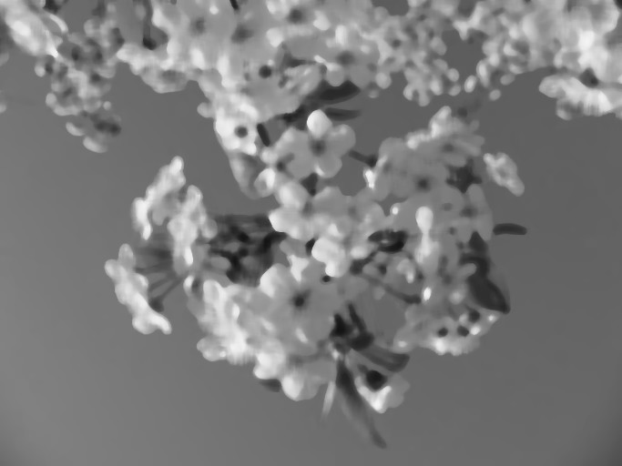

# Median filter

Next on our plate, we have actual smoothing algorithms. Previously, we have been discussing blurring, which does fall under the moniker of smoothing. However, when one refers to "smoothing" filters, it is assumed that it relates to taking a pixelated image and smoothing certain noisy parts of it out to make it clearer and less noisy. This is in contrast to blurring, which tends to "smooth" the entire image almost uniformly. Now, let's delve into the median filter.&#x20;

The mathematical median is a function that derives the midpoint value of a sorted set of odd length. If the length is even, we instead take the average of the two middlemost values. Mathematically speaking, here is what it would look like:


$$
\text{Median} = 
\begin{cases}
    x_{\frac{n+1}{2}} & \text{if } n \text{ is odd}, \\
    \frac{1}{2}\left(x_{\frac{n}{2}} + x_{\frac{n}{2}+1}\right) & \text{if } n \text{ is even}.
\end{cases}
$$

Here is the pseudo-code representation

```
Median():
    sorted = SORT(array)
    length = LEN(array)
    if isOdd(length) 
        return sorted[FLOOR(length / 2)]
    if isEven(length) 
        return AVERAGE(sorted[CEIL(length / 2)], sorted[FLOOR(length / 2)])
```

So, the median filter works similarly to the previously discussed functions; we loop through each pixel and take an area specified by the kernel dimensions. From this neighborhood of pixels, we extract the median and assign the current pixel to it. Let's take a look at the implementation.

## Implementation

```c
void cv_apply_median_filter(Image* img, int size) {
    /* ... */
    for (int i = 0; i < img->height; ++i) {
        for (int j = 0; j < img->width; ++j) {
            for (int k = 0; k < size; ++k) {
                for (int l = 0; l < size; ++l) {
                    /* ... */
                    if (row <= 0 && row > img->height && col <= 0 && col > img->width) continue;
                    for (int c = 0; c < ch; ++c) {
                      pixelArray[pixelCount++] = img->bytes[(row * img->width + col) * ch + c];
                    }
                }
            }
            for (int c = 0; c < ch; ++c) {
              unsigned char medianValue = calculate_median(pixelValues, pixelCount);
              tempBytes[(i * img->width + j) * ch + c] = medianValue;
            }

            /* ... */
        }
    }
    /* ... */
}
```

I will be the first to admit this code isn't the cleanest. Let's break down what we are doing.&#x20;

* We loop through each pixel of the image (more specifically each channel)
* We have an array called `pixelArray` where we will store all the values which fall within the kernel
* The loop assigns the pixels to this `pixelArray`, we then apply a function `calculate_median`&#x20;
* The returned value is assigned to the current pixel

The implementation for the `calculate_median` varies, our implementation does a bubble sort and returns the median.

```c
unsigned char calculate_median(unsigned char* pixelValues, int size) {
    for (int i = 0; i < size - 1; ++i) {
        for (int j = 0; j < size - i - 1; ++j) {
            if (pixelValues[j] > pixelValues[j + 1]) {
                unsigned char temp = pixelValues[j];
                pixelValues[j] = pixelValues[j + 1];
                pixelValues[j + 1] = temp;
            }
        }
    }
   /* ... */
   return median;
}
```

## Result

```bash
.\bin\cv --median --kernel 9 .\data\img1.jpg ..\output.jpg
```

<div>

<figure><figcaption><p>Original image</p></figcaption></figure>

<figure><figcaption><p>Median filter of kernel size 9</p></figcaption></figure>

</div>

## Problems

The median filter is known for it's slow performance, the primary bottleneck the calculation of the median, where we have to sort through all the neighboring pixels. On doing some performance benchmarks on my machine (`11th Gen Intel i3-1115G4 (4) @ 2.995GHz`)

```
Median filter
-------------
kernelSize = 3: 1.313351 sec
kernelSize = 5: 17.4138504 sec
kernelSize = 9: 183.1088042 sec
```

The time complexity here is abysmal which is why we need the **Bilateral filter** which we will discuss next.
