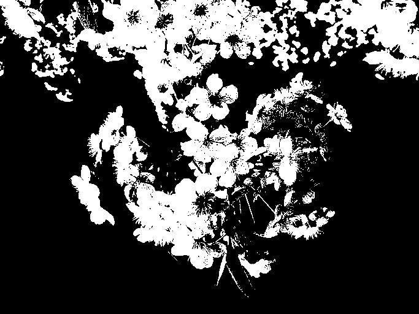

# Thresholding

## Global Thresholding

A threshold defines a upper-limit, which is exactly how Thresholding works in Computer Vision. We convert the image to grayscale, then we use some kind of limit between 0-255, let's say 128, now any number below 128 will be set to 0 and any number up will be set to 256, effectively reducing the color info of a image to a binary scale of white/black. 

This has several use-cases, for instance in OCR, or digitizing scanned hand-written text relies heavily on this method to accentuate the pen strokes and to minimize things like shakey strokes or the texture of the paper from getting onto the scanned copy. In a similar way this is also useful in recongizing oject since it essentially gives us an imprint of the objects present in an image. Let's see how this is implemented.

### Implementation 

Global thresholing is just a function which takes in an image and a threshold and normalizes the pixels to be either white or black based on that.

Global thresholding is implemented at [src/thresholding/global.c](../src/thresholding/global.c)

```c
void cv_apply_global_threshold(Image * img, int threshold) {
  cv_apply_grayscale(img);

  /* ... */

  for (int i = 0; i < height; i++) {
    for (int j = 0; j < width; j++) {
      int pixel_value = img->bytes[(i * width) + j];
      img->bytes[(i * width) + j] = pixel_value >= threshold ? GRAYSCALE_WHITE : GRAYSCALE_BLACK;
    }
  }
}
```

- We first convert the image to grayscale, this is crucial since we need to reduce the color info to a "scale" and not RGB values
- We loop through each pixel
  - If the pixel_value < `threshold` then we set it to `GRAYSCALE_WHITE` (255)
  - If the pixel_value > `threshold` then we set it to `GRAYSCALE_BLACK` (0)


### Result

```shell
.\bin\cv --global-threshold --sigma 128 .\data\img1.jpg .\output.jpg
```

<div>

<figure><figcaption><p>Original image</p></figcaption></figure>

<figure><figcaption><p>Global Threshold of 128</p></figcaption></figure>

</div>

### Problem

Manually setting a threshold involves a lot of guess-work, one threshold that works now might not work another image, this is because there are several variables eg Shadows, Contrast, Lighting involved that make each image different. a value of 128 is the mid-point but might not work for lighter or darker images. 
