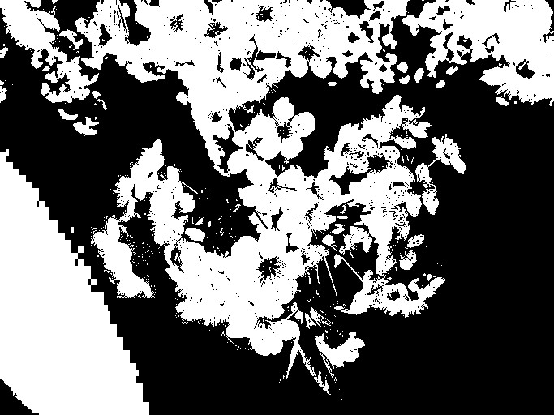

# Thresholding

## Global Thresholding

A threshold defines a upper-limit, which is exactly how Thresholding works in Computer Vision. We convert the image to grayscale, then we use some kind of limit between 0-255, let's say 128, now any number below 128 will be set to 0 and any number up will be set to 256, effectively reducing the color info of a image to a binary scale of white/black. 

This has several use-cases, for instance in OCR, or digitizing scanned hand-written text relies heavily on this method to accentuate the pen strokes and to minimize things like shakey strokes or the texture of the paper from getting onto the scanned copy. In a similar way this is also useful in recongizing oject since it essentially gives us an imprint of the objects present in an image. Let's see how this is implemented.

### Implementation 

Global thresholing is just a function which takes in an image and a threshold and normalizes the pixels to be either white or black based on that.

Global thresholding is implemented at [src/thresholding/global.c](../src/thresholding/global.c)

```c
void cv_apply_global_threshold(Image * img, int threshold) {
  cv_apply_grayscale(img);

  /* ... */

  for (int i = 0; i < height; i++) {
    for (int j = 0; j < width; j++) {
      int pixel_value = img->bytes[(i * width) + j];
      img->bytes[(i * width) + j] = pixel_value >= threshold ? GRAYSCALE_WHITE : GRAYSCALE_BLACK;
    }
  }
}
```

- We first convert the image to grayscale, this is crucial since we need to reduce the color info to a "scale" and not RGB values
- We loop through each pixel
  - If the pixel_value < `threshold` then we set it to `GRAYSCALE_WHITE` (255)
  - If the pixel_value > `threshold` then we set it to `GRAYSCALE_BLACK` (0)


### Result

```shell
.\bin\cv --global-threshold --sigma 128 .\data\img1.jpg .\output.jpg
```

<div>

<figure><figcaption><p>Original image</p></figcaption></figure>

<figure><figcaption><p>Global Threshold of 128</p></figcaption></figure>

</div>

### Problem

Manually setting a threshold involves a lot of guess-work, one threshold that works now might not work another image, this is because there are several variables eg Shadows, Contrast, Lighting involved that make each image different. a value of 128 is the mid-point but might not work for lighter or darker images. 

## Otsu's Method

Since each image is different, Nobuyuki Otsu came up with a method to compute the threshold for each image based on an histogram of each pixels and their corresponding 0-256 color value. 

The Otsu threshold implementation works by calculating a class variance between each of the histogram bars, 255 to be precise, the key here is to extract the bar with the maximum class variance and the label (not the value!) of that bar will be our threshold.


### Implementation

The Otsu algorithm is implemented at [src/thresholding/otsu.c](src/thresholding/otsu.c)


```c
void cv_apply_otsu_threshold(Image *img) {
    cv_apply_grayscale(img);

    /* ... */

    int histogram[GRAYSCALE] = {0};
    for (int i = 0; i < imgLength; i++) {
      histogram[img->bytes[i]]++;
    }

    float normHistogram[GRAYSCALE] = {0};
    for (int i = 0; i < GRAYSCALE; i++) {
      normHistogram[i] = (float)histogram[i] / imgLength;
    }

    /* ... */

    for (int i = 0; i < GRAYSCALE; i++) {
      cumulativeSum += normHistogram[i];
      cumulativeMean += i * normHistogram[i];

      globalMean = cumulativeMean;

      float mean1 = cumulativeMean / cumulativeSum,
            mean2 = (globalMean - cumulativeMean) / (1 - cumulativeSum);

      classVariance = cumulativeSum * (1 - cumulativeSum) * (mean1 - mean2) *  (mean1 - mean2);

      if (classVariance > maxVariance) {
        maxVariance = classVariance;
        optimalThreshold = i;
      }
    }
    /* ... */
}
```

Let's break down what is going on here. 

- To begin with we compute a `histogram`, which is an array where each index corresponds to a value between 0 and 256, and at that index is the amount of pixels of that color within the image.

- We then need to normalize this histogram to present it as a value between 0..1 or express it as a fractional value. 

- We then loop once across each of the "bars" within the histogram and for each we do the following
  - We add to the `cumulativeMean`, which is the sum of all the means up until the current iteration
  - We add to the `cumulativeSum` which similarly is the sum of all normalized histogram values until the current iteration

- To then actually calculate the class variance we apply the formula to give us the actual variance

```
classVariance = 
  cumulativeSum * (1 - cumulativeSum) * (mean1 - mean2) *  (mean1 - mean2);
```

- To find the threshold, we need to find the max variance, so we store the variance in a `maxVariance` and if the current is higher than previous, we re-set the variable and set the threshold accordingly.

### Result

```shell
.\bin\cv --otsu-threshold .\data\img1.jpg .\output.jpg
```

> [INFO] Applying optimal threshold of 116

<div>

<figure><figcaption><p>Original image</p></figcaption></figure>
<figure><figcaption><p>Otsu threshold</p></figcaption></figure>

</div>


The results are calculated instead of being arbitiarym which creates a more appealing output. 
